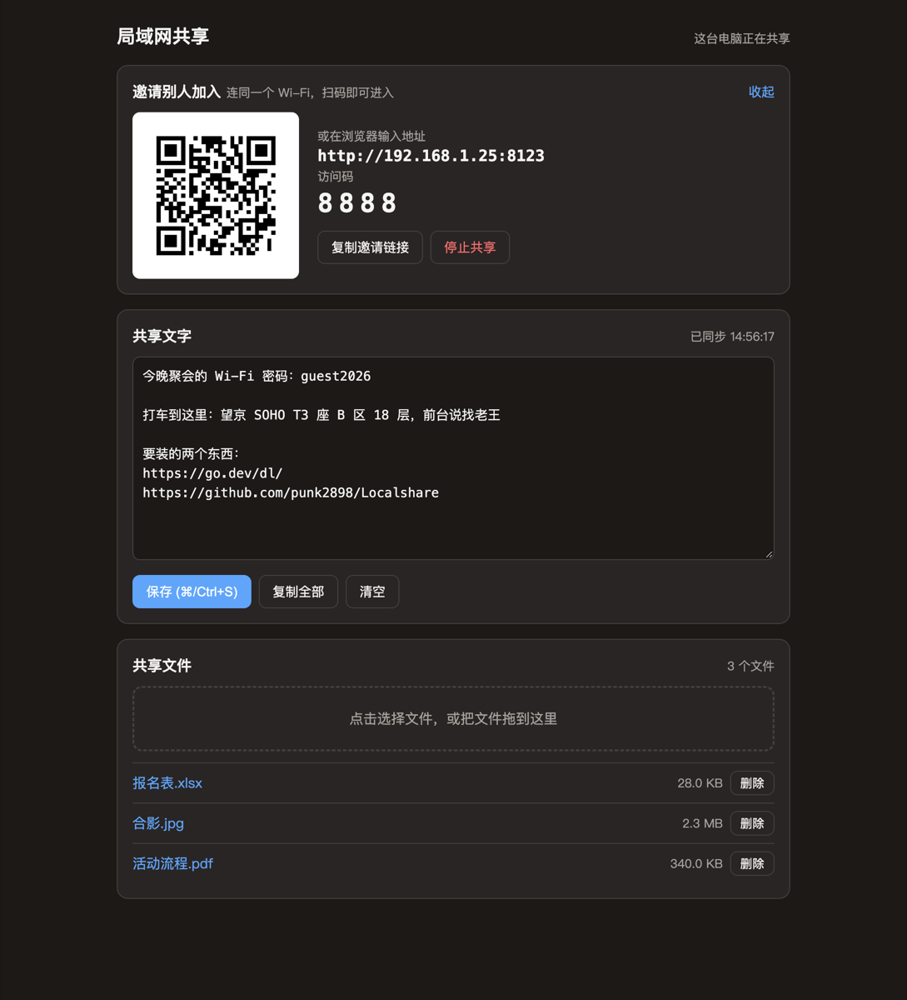
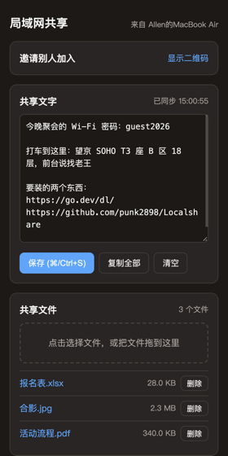
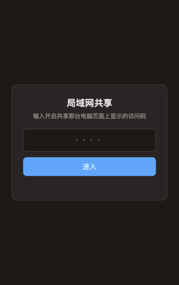

<div align="center">


# Localshare · 局域网共享

**同一个 Wi-Fi 下，扫个码就能互传文字和文件。**<br>
不走外网，不用注册，其他人什么都不用装。



</div>

## 它能做什么

- 开共享的电脑上会显示**二维码**，别人拿手机扫一下就进来了
- **共享文字**：贴进去的地址、密码、链接，所有人都能看到，也能直接复制走
- **共享文件**：拖进去就能传，别人点一下就能下载
- 自带 4 位**访问码**，同一个 Wi-Fi 下的陌生人进不来（扫码会自动带上访问码）
- 东西都存在开共享那台电脑的 `~/Localshare` 里，关掉重开还在

<div align="center">

&nbsp;&nbsp;&nbsp;

<br><em>左：手机扫码进来后的样子　右：没有访问码的人只能看到这个</em>
</div>

## 用法一：Mac 客户端（推荐）

1. 到 [Releases](../../releases/latest) 下载 `Localshare-mac.zip`，解压后把「局域网共享」拖进「应用程序」
2. 双击打开，浏览器会自动弹出共享页面，上面有二维码和访问码
3. 其他人连同一个 Wi-Fi，扫码进入
4. 用完在页面上点「停止共享」

**第一次打开可能会遇到这两个弹窗：**

- **「无法验证开发者」或「已损坏」**：因为这个 App 没有花钱做苹果签名。打开「系统设置 → 隐私与安全性」，拉到最下面点「仍要打开」。
  也可以在终端执行下面这行命令，之后就能正常双击：
  ```bash
  xattr -dr com.apple.quarantine /Applications/局域网共享.app
  ```
- **「是否允许接受传入的网络连接」**：点「允许」，不然别的设备连不上。

## 用法二：让 AI 帮你启动

把仓库克隆下来，用 Claude Code、Cursor 等 AI 编程工具打开这个文件夹，然后跟它说：

> 帮我启动局域网共享

AI 会按 [AGENTS.md](AGENTS.md) 里的步骤启动，然后把地址和访问码告诉你。电脑上有没有装 Go 都行：没装的话，启动脚本会自动下载编译好的程序。

## 用法三：命令行

```bash
./scripts/start.sh
```

终端里会打印地址、访问码，还有一个可以直接扫的二维码。常用参数：

| 参数 | 作用 |
|---|---|
| `-password 1234` | 指定访问码（会记住） |
| `-no-password` | 这次不设访问码 |
| `-port 9000` | 换端口（默认 8000，被占用会自动往后找） |
| `-dir 路径` | 换数据目录（默认 `~/Localshare`） |
| `-no-open` | 不自动打开浏览器 |

Windows 用户可以从 Releases 下载 `localshare-windows-amd64.exe`，双击运行。

## 常见问题

- **别人打不开？** 确认连的是同一个 Wi-Fi。有些公司网络和酒店 Wi-Fi 会禁止设备之间互相访问，这种情况可以改用手机热点。
- **手机上「复制全部」不管用？** 因为是 http 页面，部分手机浏览器不允许网页写剪贴板，长按文本框手动复制就行。
- **安全吗？** 数据只在局域网里传，不经过任何服务器。访问码只能挡住随手乱连的人，别拿它共享敏感内容。

## 开发

```bash
go run ./cmd/localshare      # 本地运行
./scripts/build-mac.sh       # 打包 Mac 客户端到 dist/
git tag v1.0.1 && git push --tags   # 触发 GitHub Actions，自动发布到 Releases
```

代码结构见 [AGENTS.md](AGENTS.md)。
